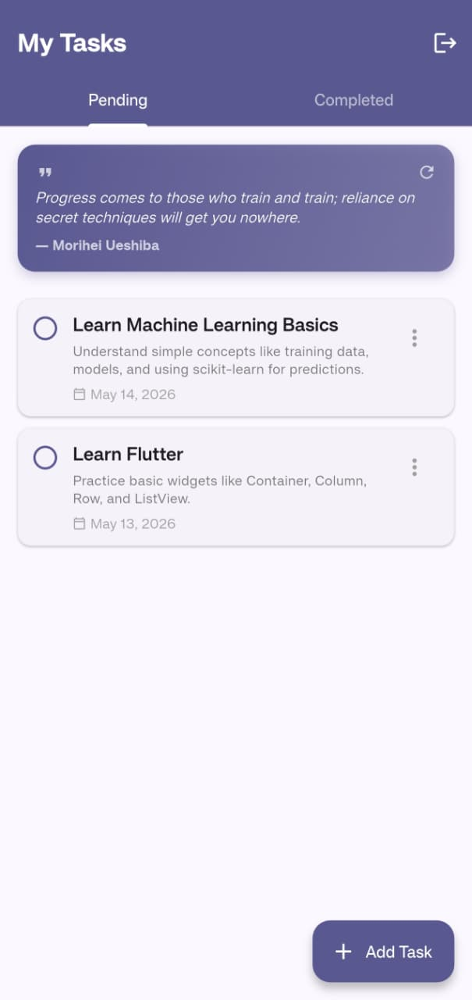

# Smart Task App

Smart Task App is a Flutter + Firebase task manager with email authentication, user-specific task CRUD, and a motivational quote widget.

## Features

- Firebase Email/Password authentication
- User-specific tasks in Cloud Firestore
- Create, update, delete, and toggle task status
- Pending and Completed tabs
- Quote card with API fallback handling
- Clean Material 3 UI

## Tech Stack

- Flutter
- Dart
- Firebase Authentication
- Cloud Firestore
- REST API for quotes

## Screenshot



If the image does not appear, add your app screenshot at `screenshots/home.png`.

## Setup

### 1. Clone and install dependencies

```bash
git clone https://github.com/cdrysumindra110/smart_task_app.git
cd smart_task_app
flutter pub get
```

### 2. Firebase configuration

Make sure Firebase is configured for this project:

- `android/app/google-services.json`
- `lib/firebase_options.dart`

Enable in Firebase Console:

- Authentication -> Email/Password
- Firestore Database

Optional (if you need to regenerate Firebase config):

```bash
dart pub global activate flutterfire_cli
flutterfire configure
```

### 3. Firestore rules

Use the following rules:

```firestore
rules_version = '2';
service cloud.firestore {
  match /databases/{database}/documents {
    match /users/{userId} {
      allow create, read, update: if request.auth != null
        && request.auth.uid == userId;
      allow delete: if false;
    }

    match /tasks/{taskId} {
      allow create: if request.auth != null
        && request.resource.data.userId == request.auth.uid;

      allow read, update, delete: if request.auth != null
        && resource.data.userId == request.auth.uid;
    }

    match /{document=**} {
      allow read, write: if false;
    }
  }
}
```

## Run

```bash
flutter run
```

If multiple devices are connected:

```bash
flutter devices
flutter run -d <device-id>
```

## Test and Analyze

```bash
flutter analyze
flutter test
```

## Project Structure

```text
lib/
  models/
  screens/
  services/
  widgets/
  main.dart
test/
  widget_test.dart
screenshots/
  home.png
```

## Troubleshooting

### Authentication failed message

- Verify Email/Password auth is enabled in Firebase.
- Fully restart the app (stop and run again).

### Firestore permission errors

- Re-check Firestore rules.
- Ensure the user is authenticated.

### Tasks not loading

- Confirm tasks are stored with `userId` matching the signed-in user.

### Quote not loading

- Check internet connectivity.
- The app uses fallback quote API logic.